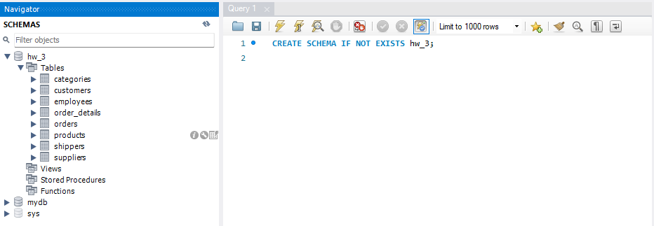
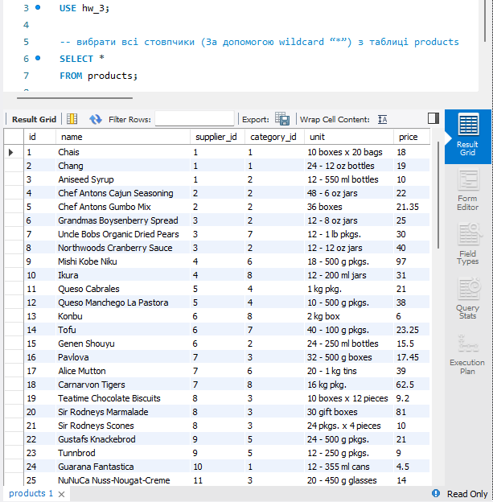
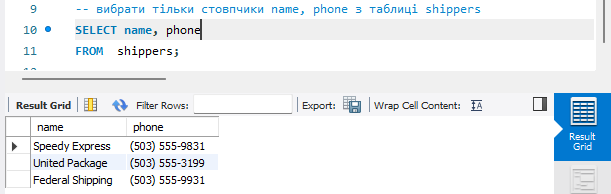
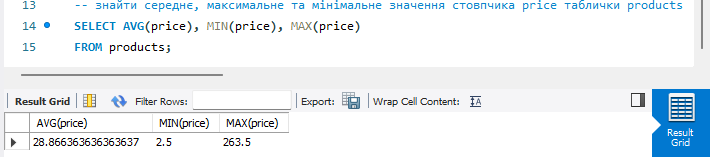
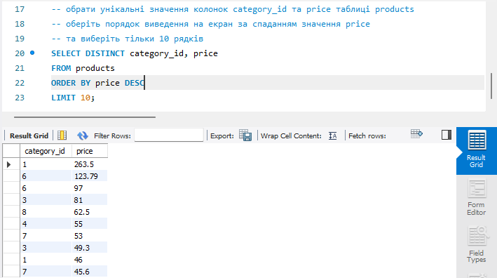
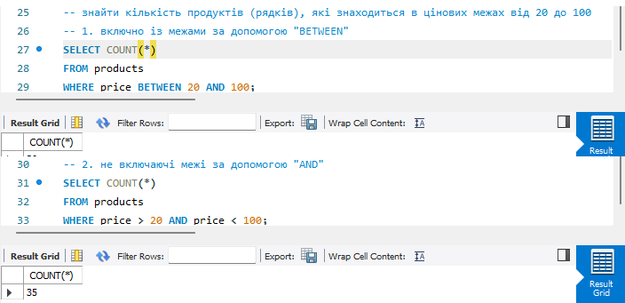
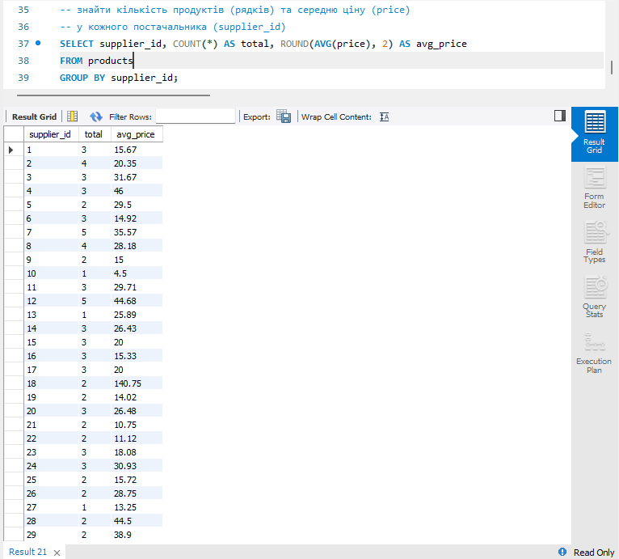

# Тема 3. Завантаження даних та основи SQL. DQL команди

## Імпортуємо таблиці

## 1. Напишіть SQL команду, за допомогою якої можна:

- вибрати всі стовпчики (За допомогою wildcard “\*”) з таблиці products;

- вибрати тільки стовпчики name, phone з таблиці shippers.

## 2. Напишіть SQL команду, за допомогою якої можна знайти середнє, максимальне та мінімальне значення стовпчика price таблички products.

## 3. Напишіть SQL команду, за допомогою якої можна обрати унікальні значення колонок category_id та price таблиці products. Оберіть порядок виведення на екран за спаданням значення price та виберіть тільки 10 рядків.

## 4. Напишіть SQL команду, за допомогою якої можна знайти кількість продуктів (рядків), які знаходиться в цінових межах від 20 до 100.

## 5. Напишіть SQL команду, за допомогою якої можна знайти кількість продуктів (рядків) та середню ціну (price) у кожного постачальника (supplier_id).

